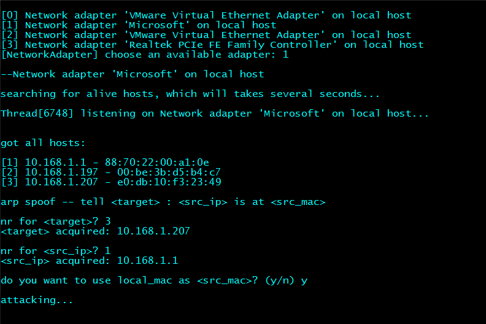
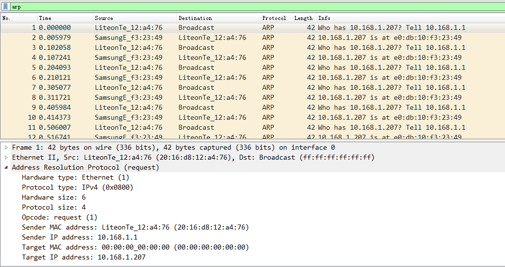
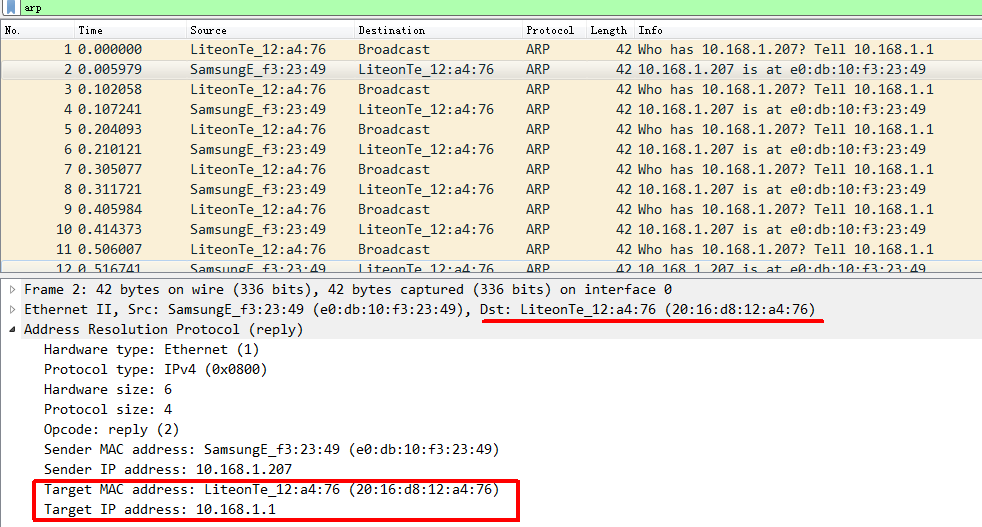
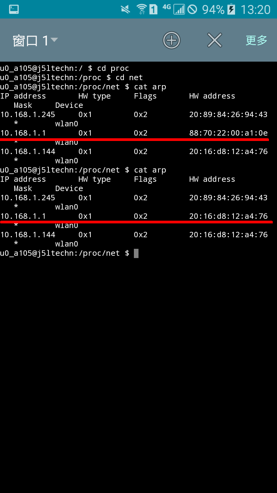
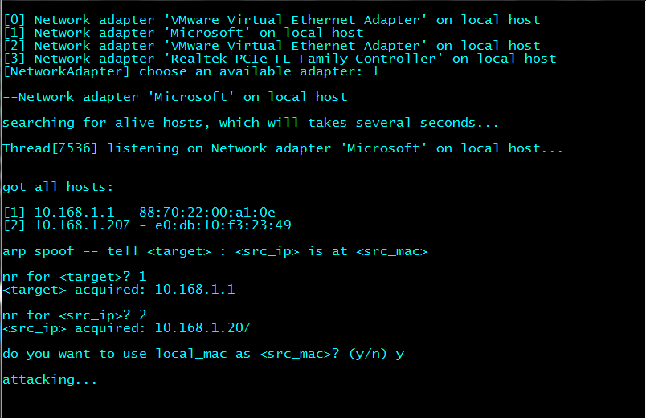
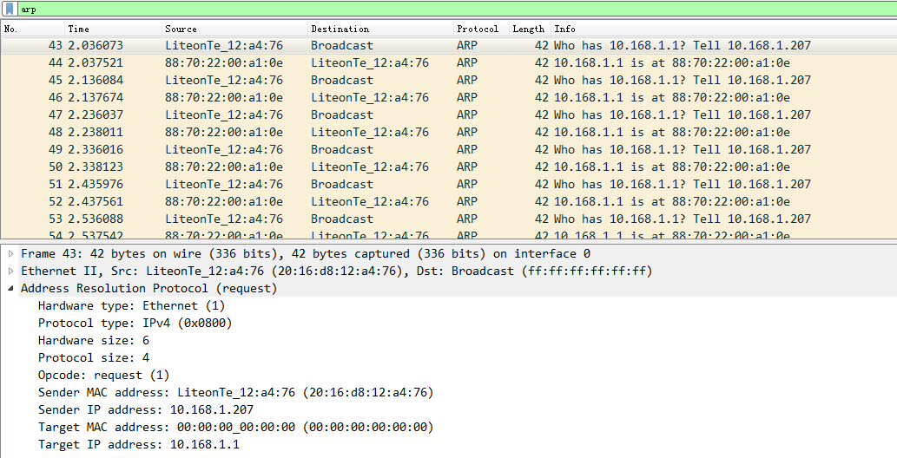
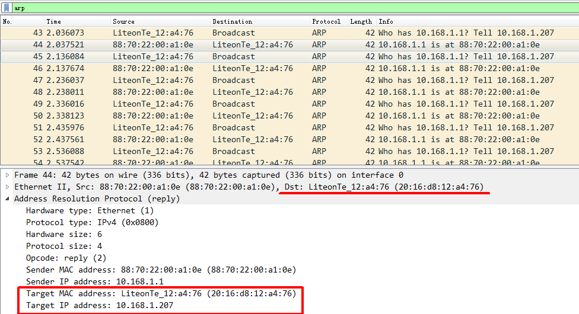

# 示例1：欺骗局域网内的一台主机
## 程序操作界面：

1. 根据当前网络连接情况选择一个可用的网络适配器. 如果是无线网络连接，选择`‘Microsoft’ on local host`.
2. 随后程序进行`ICMP`探测，得到局域网内存活主机列表.
3. 选择欺骗目标`<target>`为`10.168.1.207`（这是我的手机），告诉`10.168.1.207`: 网关:`10.168.1.1`的MAC地址本机MAC地址，目的是让`10.168.1.207`发送给网关的数据包发送到本机.

## ARP欺骗过程的数据包分析:
下图是程序发送的用于实现ARP欺骗的报文：

用于**ARP欺骗**的是一个以广播形式发送的**ARP请求**, 其含义是：网关`10.168.1.1`正在请求主机`10.168.1.207`的MAC地址. 局域网内所有主机都会收到这个ARP请求，但只有`10.168.1.207`响应了这个广播. `10.168.1.207`响应ARP请求时，先使用ARP首部的`Sender MAC`和`Sender IP`更新自己的ARP缓存，然后以单播形式向`10.168.1.1`发送**ARP应答**, 但这个ARP应答不会到达`10.168.1.1`, 因为在发送ARP应答之前对应的ARP缓存项已被修改了, 查看这个ARP应答即可验证：

`20:16:d8:12:a4:76`正是本机的MAC地址，但`10.168.1.207`以为这是网关的MAC地址.

## 查看被攻击主机的ARP缓存：
在Android手机上安装一个终端模拟器, 可以查看到攻击前后的ARP缓存的变化情况：

## 攻击结果分析
- 启动`ArpSpoof.exe`后，本机网络连接出现异常，只能通过重启解决；
- 如果本机连接了网线，且当前网络连接为 "无线网络连接"，网络适配器选择`'Microsoft' on local host`，则可以实现**中间人攻击**，即被攻击主机的网络连接正常，但所有本应发送给网关路由器的数据包都发送到了本机，可以通过WireShark抓包证实；
- 如果不连接网线，被攻击主机的网络连接将被切断.

# 示例2：欺骗网关
## 程序操作界面：

告诉网关: `10.168.1.207`的MAC地址为本机MAC地址，目的是让网关转发给`10.168.1.207`的数据包到达本机.

## ARP欺骗过程的数据包分析:
下图是程序发送的用于实现ARP欺骗的报文：

这个**ARP请求**的含义是：`10.168.1.207`正在请求网关路由器的MAC地址；其效果是：网关响应这个ARP请求时，先使用ARP首部的`Sender MAC`和`Sender IP`更新自己的ARP缓存，而`Sender MAC`不是`Sender IP`对应的真实MAC，而是本机的MAC! 从网关的**ARP应答**中可以发现攻击成功了：

## 攻击结果分析
与*示例1*一样，本机连接网线，网络连接选择 "无线网络连接"，网络适配器选择`'Microsoft' on local host`，以此实现中间人攻击. 攻击启动后，`10.168.1.207`的网络连接正常，使用WireShark可以监听到网关转发给`10.168.1.207`的数据包. 在WireShark中选择过滤条件`http`，就可以抓取到`10.168.1.207`请求的网页，将正文部分：`右键->存储->...为一个Hex流`，新建一个文本文件，将复制的Hex流粘贴进去并保存该文本文件，然后使用`tool/hex_decode`将其转储为二进制文件`binfile`，对其重命名，附上正确的扩展名，即可打开查看之（示例文件在`data/`）.